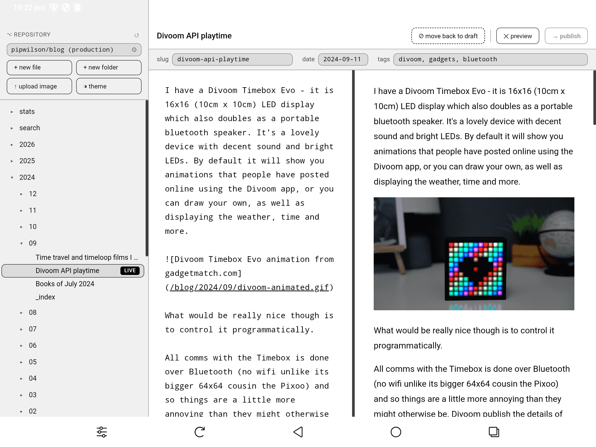

# Zola Blog Editor

A desktop (and Android) app for writing and publishing posts to a [Zola](https://www.getzola.org/) static site hosted on GitHub. Write in Markdown, manage drafts, and commit directly to your repo.

Built with [Tauri 2](https://tauri.app/): a Rust backend wrapping a WebView frontend, with native credential storage and local file operations.

This project was authored by [Claude Code](https://claude.com/product/claude-code).

It operates directly on your project in GitHub. It does not download your files to work on locally

It provides user-selectable light, dark and e-ink specific themes.

A screenshot of Zola Blog Editor running on an e-ink android device:



## Features

- Collapsible file tree showing your full posts directory
- Markdown editor with lightweight syntax highlighting
- Live split-pane preview (resizable)
- TOML (`+++`) and YAML (`---`) frontmatter support — title, date, tags, slug
- Publish to GitHub with one click (commits via the GitHub Contents API)
- Move published posts back to draft
- Right-click context menu: new post in folder, rename
- Config and GitHub token persisted in the OS keychain via `tauri-plugin-store`
- Keyboard shortcuts: `Ctrl+S` publish draft · `Ctrl+Enter` publish · `Ctrl+N` new post · `Ctrl+P` preview · `Ctrl+,` settings

---

## Prerequisites

### Desktop (Windows)

| Tool | Notes |
|------|-------|
| [Node.js](https://nodejs.org/) 18+ | |
| [Rust](https://rustup.rs/) stable | |
| [Visual Studio C++ build tools](https://visualstudio.microsoft.com/visual-cpp-build-tools/) | Required by Tauri on Windows |
| WebView2 runtime | Pre-installed on Windows 10 / 11 |

### Android (additional requirements)

| Tool | Notes |
|------|-------|
| [JDK 17](https://adoptium.net/) | Temurin 17 LTS recommended |
| [Android Studio](https://developer.android.com/studio) | Installs the Android SDK |
| Android NDK | Android Studio → SDK Manager → SDK Tools → NDK (Side by side) |
| Windows Developer Mode | Settings → System → For developers → Developer Mode (needed for symlink creation during build) |

Set environment variables:

```powershell
$env:JAVA_HOME    = "C:\Program Files\Eclipse Adoptium\jdk-17.x.x.x-hotspot"
$env:ANDROID_HOME = "C:\Users\<you>\AppData\Local\Android\Sdk"
$env:NDK_HOME     = "C:\Users\<you>\AppData\Local\Android\Sdk\ndk\<version>"
# Also add %ANDROID_HOME%\platform-tools to PATH
```

Install Android Rust cross-compilation targets:

```powershell
rustup target add aarch64-linux-android armv7-linux-androideabi i686-linux-android x86_64-linux-android
```

---

## Building

Install JS dependencies (one-time):

```powershell
npm install
```

### Desktop

```powershell
npm run build
```

### Android

```powershell
npm run android:build            # release APK (unsigned)
npm run tauri -- android build --debug   # debug APK (auto-signed, directly installable)
```

### Development / hot-reload

```powershell
npm run dev                      # desktop
npm run android:dev              # Android — requires a connected device or running emulator
```

---

## Output artifacts

### Desktop

| Artifact | Path |
|----------|------|
| NSIS installer (`.exe`) | `src-tauri\target\release\bundle\nsis\` |
| WiX installer (`.msi`) | `src-tauri\target\release\bundle\msi\` |
| Raw executable | `src-tauri\target\release\zola-blog-editor.exe` |

> Cargo build output is stored outside Dropbox at
> `C:\Users\<you>\.cargo-targets\zola-blog-editor\`
> to avoid file-lock conflicts. See `.cargo/config.toml`.

### Android

| Artifact | Path |
|----------|------|
| Release APK (unsigned) | `src-tauri\gen\android\app\build\outputs\apk\universal\release\app-universal-release-unsigned.apk` |
| Debug APK (debug-signed) | `src-tauri\gen\android\app\build\outputs\apk\universal\debug\app-universal-debug.apk` |

Install the debug APK directly via ADB:

```powershell
adb install -r src-tauri\gen\android\app\build\outputs\apk\universal\debug\app-universal-debug.apk
```

**Signing the release APK for distribution:**

```powershell
# Generate a keystore (one-time)
keytool -genkey -v -keystore zola-blog-editor.jks -alias zola -keyalg RSA -keysize 2048 -validity 10000

# Sign
$bt = "$env:LOCALAPPDATA\Android\Sdk\build-tools\$(Get-ChildItem $env:LOCALAPPDATA\Android\Sdk\build-tools | Sort-Object Name | Select-Object -Last 1 -ExpandProperty Name)"
& "$bt\apksigner.exe" sign --ks zola-blog-editor.jks --ks-key-alias zola --out app-signed.apk `
    "src-tauri\gen\android\app\build\outputs\apk\universal\release\app-universal-release-unsigned.apk"
```

---

## Project structure

```
zola-blog-editor/
├── .cargo/
│   └── config.toml          # Cargo target-dir
├── src/
│   ├── index.html           # App UI
│   ├── main.js              # All frontend logic
│   └── styles.css           # Styles and theme
├── src-tauri/
│   ├── src/
│   │   ├── main.rs          # Tauri entry point
│   │   └── lib.rs           # Rust commands (config, local save/load)
│   ├── gen/android/         # Generated Android project (Gradle)
│   ├── capabilities/        # Tauri permission declarations
│   ├── Cargo.toml
│   └── tauri.conf.json      # App name, window size, bundle config
└── package.json
```

---

## First run

On first launch the app opens a settings dialog. You need:

- A **GitHub personal access token** — classic token, `repo` scope
  Create one at: github.com/settings/tokens → Generate new token (classic) → check **repo**
- The **repository** in `owner/repo` format
- The **branch** (default: `main`)
- The **posts path** in the repo (default: `content/blog`)

Settings are persisted across launches via the OS-native store.

---

## Frontmatter formats

Both TOML and YAML frontmatter are supported.

**TOML** (`+++` delimiters — Zola default):
```toml
+++
title = "My post title"
date = 2025-05-19
draft = true

[taxonomies]
tags = ["zola", "web"]
+++
```

**YAML** (`---` delimiters):
```yaml
---
title: My post title
date: 2025-05-19
draft: true
taxonomies:
  tags: [zola, web]
---
```
